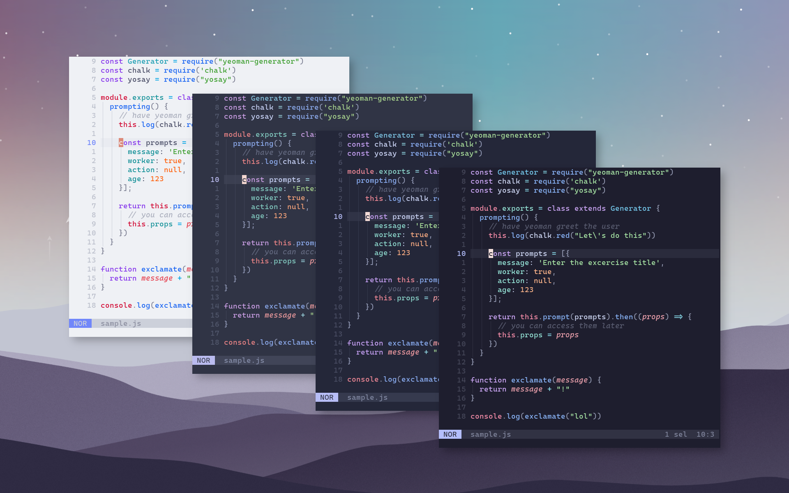

<h3 align="center">
	<br/>
	
	Catppuccin for <a href="https://github.com/helix-editor/helix">Helix</a>
	
</h3>
<p align="center"><a href="https://github.com/catppuccin/catppuccin/blob/main/LICENSE"></a></p>


<p align="center">
    <a href="https://github.com/catppuccin/helix/stargazers"></a>
    <a href="https://github.com/catppuccin/helix/issues"></a>
    <a href="https://github.com/catppuccin/helix/contributors"></a>
</p>



## Usage

1. Copy the contents of the `italics` or `no_italics` folder into `$HOME/.config/helix/themes/catppuccin.toml`.
2. Choose a palette (latte, frappe, macchiato, mocha) and add `theme = "catppuccin_(palette)"` to your config.toml
3. Add cursor mode indicator to your config.toml:
	```toml
	[editor.cursor-shape]
	insert = "bar"
	normal = "block"
	select = "underline"
	```
