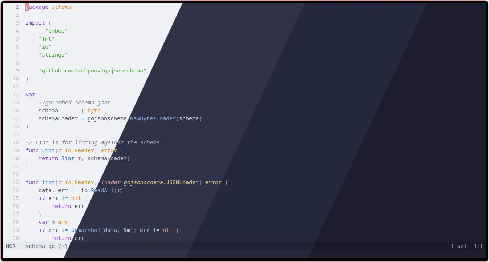

<h3 align="center">
	<br/>
	
	Catppuccin for <a href="https://github.com/helix-editor/helix">Helix</a>
	
</h3>

<p align="center">
    <a href="https://github.com/catppuccin/helix/stargazers"></a>
    <a href="https://github.com/catppuccin/helix/issues"></a>
    <a href="https://github.com/catppuccin/helix/contributors"></a>
</p>



## Usage

1. Helix itself includes the default variant of the theme. For other variants, copy the contents of the `themes/...` folder into `$HOME/.config/helix/themes/` to overwrite.
2. Choose a palette (latte, frappe, macchiato, mocha) and add `theme = "catppuccin_(palette)"` to your config.toml
3. (Optional) modify your `$HOME/.config/helix/config.toml` to activate features:
	```toml
	[editor]
	line-number = "relative"
	cursorline = true
	color-modes = true

	[editor.cursor-shape]
	insert = "bar"
	normal = "block"
	select = "underline"

	[editor.indent-guides]
	render = true
	```

## Customizations

You can customize the themes by inheriting your preferred flavor and applying your own modifications. For example, to create a pure black theme based on `catppuccin_mocha`, create a new file in `$HOME/.config/helix/themes/` with the following content:

```toml
inherits = "catppuccin_mocha"

[palette]
base = "#000000"
mantle = "#010101"
crust = "#020202"
```

## FAQ

### The theme isn't loading or working properly

Make sure the theme is in the correct directory and the `theme` field in your `config.toml` is set correctly.

If the theme is still not working, it may be due to true color support. Make sure your terminal emulator supports true color and is configured correctly. If you are certain that your terminal emulator supports true color, then you can try overriding Helix's true color detection in your config file as follows:

```toml
[editor]
true-color = true
```

If you still can't get the theme to work, please [open an issue](https://github.com/catppuccin/helix/issues)!
	
## Building the themes

Modfiy the themes by editing the template (`data/template.tmpl`), the palettes (`/data/palettes`) or the configs (`/data/configs`).
To generate all the themes execute `python generate.py`.

## 💝 Thanks to

- [ohxxm](https://github.com/ohxxm)

&nbsp;

<p align="center">
	
</p>

<p align="center">
	Copyright &copy; 2021-present <a href="https://github.com/catppuccin" target="_blank">Catppuccin Org</a>
</p>

<p align="center">
	<a href="https://github.com/catppuccin/catppuccin/blob/main/LICENSE"></a>
</p>
